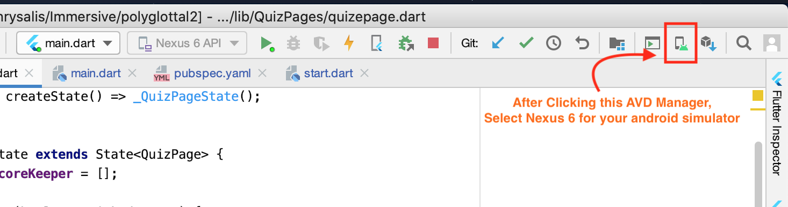
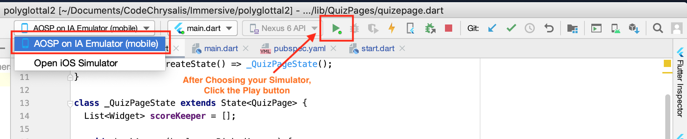

 

<h3 align="center">Polyglottal Project by Kohki Shiga</h3>

# Trivia

**A mobile quiz app for killing time. **

## Getting Started (Installation)

### Step 1
Install the following editors into your computer:
1) [Android Studio](https://developer.android.com/studio) 

2) [Xcode](https://developer.apple.com/xcode/)

**If you already have it installed, skip this step.**

### Step 2
Create a virtual simulator for an Android and IOS device.

<h5 align="left">Step 2-1</h5>

 

<h5 align="left">Step 2-2</h5>

 

### Step 3
Run main.dart after specifying the simulator you want to test in onto.

## Deployment

 Aiming to release this app in the near future on [App Store](https://www.apple.com/ios/app-store/) and [Google Play](https://play.google.com/store?hl=en).

## Built With

-   [Dart]([[https://dart.dev/](https://dart.dev/)]([https://dart.dev/](https://dart.dev/)))  - a client-optimized language for fast apps on any platform
-   [Flutter]([[https://flutter.dev/?gclid=Cj0KCQjwwr32BRD4ARIsAAJNf_1BW0LYyjc_h_-iRFMvO-C4N5n0oj9GCurPDwSVcrF_hnAMObsf6-saAsxyEALw_wcB&gclsrc=aw.ds](https://flutter.dev/?gclid=Cj0KCQjwwr32BRD4ARIsAAJNf_1BW0LYyjc_h_-iRFMvO-C4N5n0oj9GCurPDwSVcrF_hnAMObsf6-saAsxyEALw_wcB&gclsrc=aw.ds)]([https://flutter.dev/?gclid=Cj0KCQjwwr32BRD4ARIsAAJNf_1BW0LYyjc_h_-iRFMvO-C4N5n0oj9GCurPDwSVcrF_hnAMObsf6-saAsxyEALw_wcB&gclsrc=aw.ds](https://flutter.dev/?gclid=Cj0KCQjwwr32BRD4ARIsAAJNf_1BW0LYyjc_h_-iRFMvO-C4N5n0oj9GCurPDwSVcrF_hnAMObsf6-saAsxyEALw_wcB&gclsrc=aw.ds)))  - Google's UI toolkit for making the app responsible to all devices.
- [Firebase](https://firebase.google.com/) - NoSQL Database

## Authors
-   ****Kohki Shiga****  -  Github: [Github Repository]([https://github.com/CarlosIUSalazar](https://github.com/CarlosIUSalazar))

## License

This project is licensed under the MIT License - see the  [LICENSE.md](https://gist.github.com/PurpleBooth/LICENSE.md)  file for details
